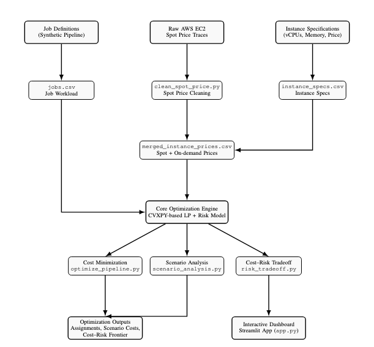

# Data Pipeline Cost Optimizer (AWS EC2)

This project builds a full optimization pipeline that assigns data-processing jobs to AWS EC2 instance types in the **lowest-cost**, **performance-aware**, and **risk-aware** way.  
Using real historical EC2 spot-price traces and a linear programming model (CVXPY), the system chooses the best instance family for each job while enforcing memory limits, performance tiers, and optional capacity constraints.

## Project Objective

- Cleans and processes **real AWS spot-price data**
- Models data-pipeline jobs with CPU hours, memory, and performance requirements
- Optimizes job placement using:
  - **Cost minimization**
  - **Performance tier enforcement**
  - **Risk modeling based on spot-price discount**
  - **Scenario simulations under spot-price volatility**
- Provides:
  - Optimal instance assignment  
  - Cost–risk Pareto frontier  
  - Spot-price simulation results  
  - A complete **Streamlit dashboard** for interactive exploration  

## Key Results

- **47.7% cost reduction** vs a naïve on-demand baseline  
- Robust to ±30% spot-price volatility  
- Clean job-to-instance assignments and cost breakdowns  
- Risk-aware optimization ensures compute stability when needed  

## Run the Optimizer

### Base optimization
python3 run_optimizer.py --mode base

### Scenario Analysis (Spot Price Volatility)
python3 run_optimizer.py --mode scenario

### Cost–Risk Optimization
python3 run_optimizer.py --mode risk --lambda 0.5

### Launch Streamlit Dashboard
streamlit run app.py

## Project Architecture

